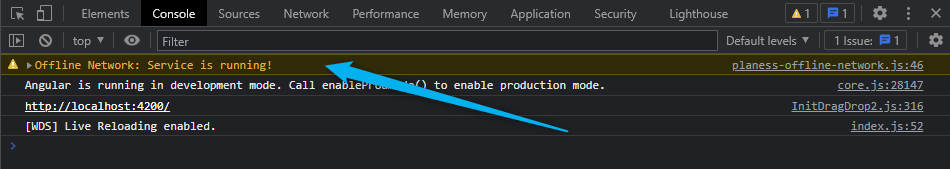
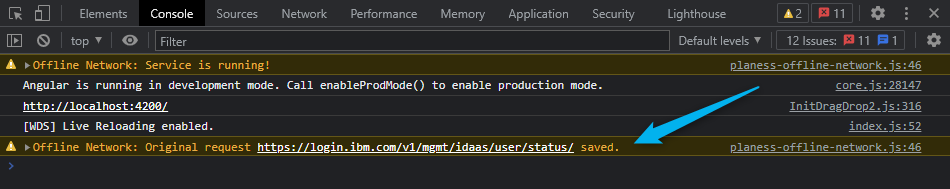
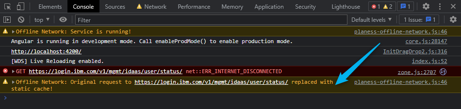
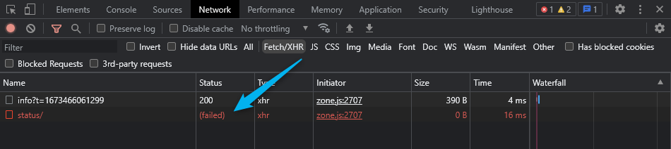

# Overview

This package helps to keep active development if internet connection is out for short time.

> This module runs only in **development** app mode.

### How it works:

Module collects all http-request via original **HttpClient** when connection is on and use the
**last** successfully performed results replacing the real http-requests by saved copies when
internet connection is off.

> HTTP-request **headers** have **no impact** on the cache and are not considered in processing at
> all.

The presence or absence of any headers will not affect the result of saving requests and response.
However, if you have some additional specific interceptors/processing of http-requests it can
make some conflicts.

# Limitations

- Minimal Angular version - 9.
- Each `HttpClientModule` import in `NgModule` brings in new instance of `HttpClient` with dedicated
  interceptors. Usually, it happens only once in root module, but you should set
  `configureOfflineNetwork` in every provider along with `HttpClientModule` import.
- Based on point above - module **will not** catch any http-request performed by
  installed third-party packages.
- All data are saved in browser storage with **IndexedDB** (or Local Storage for the second
  priority). In the browser private tab it exists until browser is closed. And you cannot
  move data to another browser manually.

# Setup

### Install the package

Run the command in your project:

```shell
npm install @planess/offline-network
```

### Invoke provider factory in NgModule

Append execution of special `configureOfflineNetwork` into main module provider (usually,
in `app.module.ts`):

```typescript
import { HTTP_INTERCEPTORS } from '@angular/common/http';
import { configureOfflineNetwork } from '@planess/offline-network';
import { environment } from 'src/environments/environment';

@NgModule({
	providers: [configureOfflineNetwork(HTTP_INTERCEPTORS, { maxAge: 60 }, environment.production)],
})
export class AppModule {}
```

Syntax is:

```typescript
function configureOfflineNetwork(
	HTTP_INTERCEPTORS_FROM_THE_APP: typeof HTTP_INTERCEPTORS,
	configuration?: Partial<Configuration>,
	productionMode: boolean,
): Provider[];
```

, arguments:

- `HTTP_INTERCEPTORS_FROM_THE_APP` - original `HTTP_INTERCEPTORS` project's token for http-requests;
- `configuration` - _optional_ set of parameters. Details are below;
- `productionMode` - whether application is running in production mode. Module is disabled for
  production version.

# Configuration

You can pass `configuration` as a second argument with any number of properties with `Configuration`
interface:

- `maxAge`: `number = 48` - number of **hours** while cache is available;
- `includeServerOff`: `boolean = false` - either server's 500 errors would use the cache. `true` -
  use cache!

# Example

1. After successful integration this package with the target project and run it in **development**
   mode you will see a message in _browser console_:



2. When connection is on all your successful XHR request via **HttpClient** service is tracked and
   responses are collected:



3. If connection is off you will get saved copy of **last** successful response:



Be aware, the http-request remains **failed** in any case:



4. A common http error is thrown if cache does not exist. You can catch and handle error by your
   own.

# Troubleshooting

#### _Everytime an error "Cache for {key} key is broken!" occurs in browser console_

Most likely DB data is corrupted for some reason.
Clear the storage: open browser inspector - tab "Application" - expand IndexedDB storage - delete
"offline-network-db" database and refresh the page.

# Changelogs

[Read the last changes](./CHANGELOG.md) if you need to upgrade package version.

# Want to help?

We would be grateful for any remarks, fix, comments, suggestions or contribution. You
can [fork the project](https://github.com/planess/offline-network-angular) and make helpful changes.

Another way is to send email to [planess.group@protonmail.com](mailto:planess.group@protonmail.com)
with your idea and contacts for communication.
